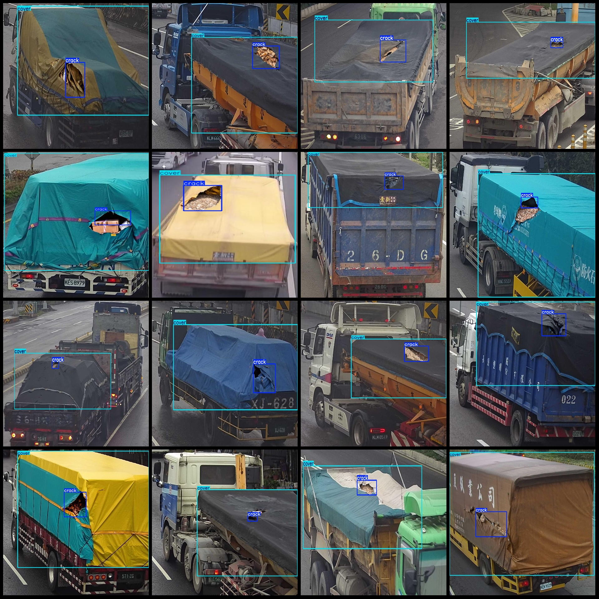
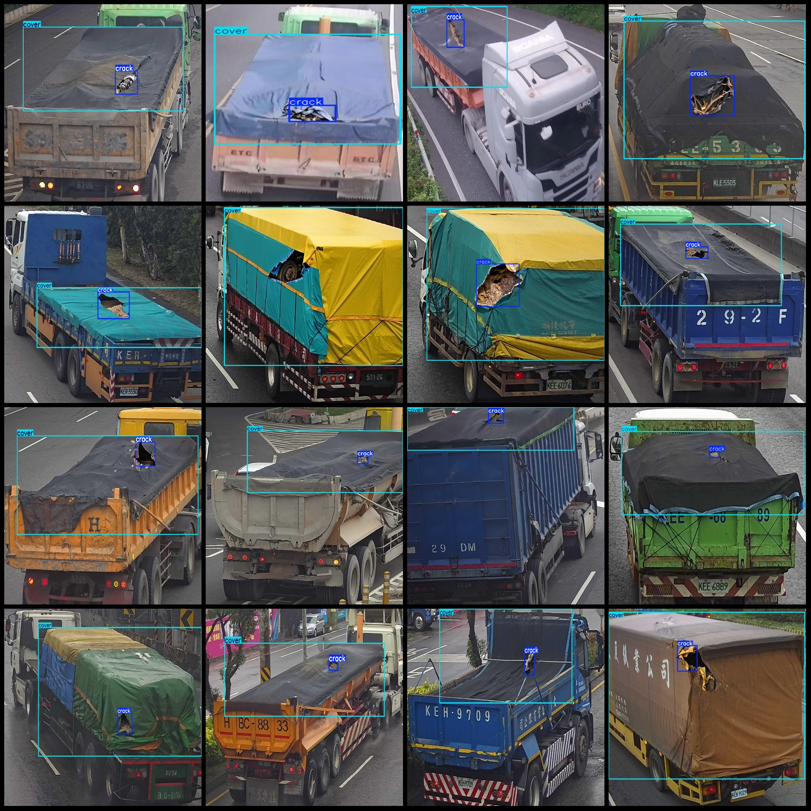

# Intelligent Transportation Data Set for Trucks: Waterproof Cover and Umbrella Defect Detection

## Dataset Format: Pascal VOC+YOLO (without the split path in txt file, just including jpg images and corresponding VOC-format xml files and YOLO-format txt files)

### Image Count (Number of JPG Files): 1894

### Annotation Count (Number of XML Files): 1894

### Annotation Count (Number of TXT Files): 1894

### Number of Annotation Categories: 2

#### Annotation Category Names: ["cover", "crack"]

Each category has a number of bounding boxes:
- cover (Truck cover) bounding box count = 1898
- crack (Umbrella damage) bounding box count = 1830

Total bounding box count: 3728

Image resolution: Multi-resolution images, such as 1027x1001, 402x571, etc.

Used annotation tool: labelImg

Annotation rules: Draw bounding boxes for each category

Important Notes: No specific notes are provided at this time.

Special Disclaimer: This dataset does not guarantee the accuracy of trained models or weight files.


---

**annotation example:**


This is an example of a simple annotation in Python. An annotation is a way of marking up code to provide information about its purpose, usage, or behavior. In this case, the annotation describes the purpose and usage of a function named `my_function`.

```python
@staticmethod
def my_function(a, b):
    """
    This function takes two arguments and returns their sum.

    Parameters:
    a (int): The first argument.
    b (int): The second argument.

    Returns:
    int: The sum of the two arguments.
    """
    return a + b
```

In this annotation, we use the `@staticmethod` decorator to indicate that the function is a static method. The docstring provides a brief description of the function's purpose, along with the parameters and return type.
- Cover
- Crack
## Images





Here is a pay link on Stripe ( https://buy.stripe.com/3cs8yP7sY87d0vu9AB ). Please contact me lonlonago@foxmail.com after funding $89, and I will send you a complete data files , thank you!


